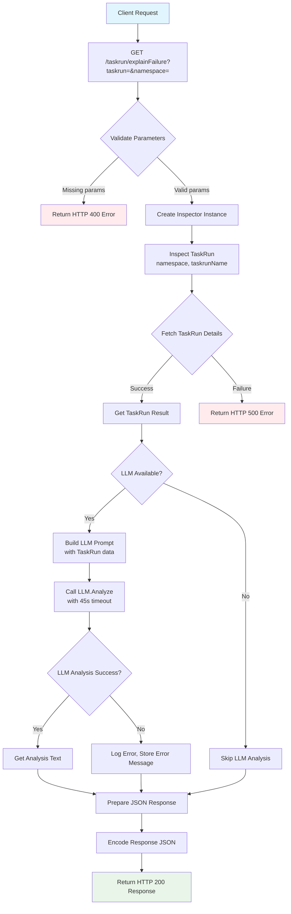

# Tekton Assistant

Tekton Assistant helps explain failed Pipelines/TaskRuns and guide remediation. 

## Tekton Assistant Overview

- **Pipeline Failure Analysis (Explain my failed pipeline)**
  - Retrieves and analyzes logs, status, and events for a failed PipelineRun/TaskRun
  - Identifies the failed step and extracts relevant error messages
  - Produces a concise summary (e.g., "Step 'build' failed due to missing dependency X")
  - Suggests actionable fixes (e.g., permissions, image pull errors)
  - Examples: "Check if secret 'docker-creds' exists in namespace Y", "Verify registry authentication"

## Flow chart
The following diagram illustrates the request flow for the tekton-assist service:



## Using Gemini LLM

### Build for local testing
```
go build ./cmd/diagnose
```

### Use command line for local testing
```
OPENAI_API_KEY="$GEMINI_API_KEY" go run ./cmd/diagnose serve \
  --openai-base-url "https://generativelanguage.googleapis.com/v1beta/openai/" \
  --openai-model "gemini-2.5-flash" --debug
```

### Deploy for local testing
```
# Base install (no secret generated by default)
KO_DOCKER_REPO=kind.local make apply

# If you want LLM calls enabled, create the secret manually (do NOT commit secrets)
# echo -n "sk-..." > /tmp/openai-api-key
# kubectl -n openshift-pipelines create secret generic openai-api-key \
#   --from-file=openai-api-key=/tmp/openai-api-key --dry-run=client -o yaml | kubectl apply -f -
```

### Developer convenience
```
# Run e2e tests against kind using the in-cluster mock OpenAI server
KO_DOCKER_REPO=kind.local go test -v ./test/...
```

### Test the deployment
```
curl -s "http://localhost:8080/taskrun/explainFailure?namespace=default&taskrun=pipelinerun-go-golangci-lint" | jq
```
